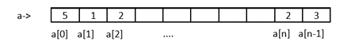
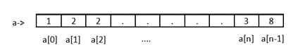

Претраживање низова
===================

Имамо низ и желимо да видимо да ли се у њему налази неки елемент. Шта ћемо урадити.
Најједноставнији начин је упоређујемо вредност траженог елемента са сваким појединачним
елементом у низу.

Али шта ако?

- не постоји елемент у низу
- имамо два или више иста елемената у низу
- имамо низ са огромним бројем елемената
- низ није уређен

Значи да закључимо:

- задатак претраживања је проналажење елемента низа који задовољава неки унапред задат услов.
- претраживањем се утврђује да ли задати елеменат постоји у низу вредности и ако постоји који је његов индекс односно позиција.
- најбоље претраживање је оно које има најмањи број поређења које је потребно извести у поступку тражења задатих вредности.

Имамо две врсте претраживања којима ћемо се бавити:

- секвенцијално претраживање 
- бинарно претраживање

Кренимо редом.

Секвенцијално претраживање
--------------------------

Сетимо се како су некада ваши родитељи слушали музику. Имали су уређај који се
вокмен и који је користио касете. На њима су се налазиле снимљене песме. На касети
је могло бити снимљено више десетина песама. Сретну друга и кажу "Дај пусти ми ону.."

Шта онда. Песма је могла бити прва на реду а могла је бити и послењдња. Значи пустали
би једну по једну док  не би нашли "ону праву ".

Или рецимо давно заборављени грамофон. 

Уколико имамо списак песама као код грамофонских плоча није проблем тачно знамо на
којој је позицији односно индексу. А шта ако немамамо списак Поново морамо пустати
једну по једну док не нађемо жељену песму.

Исти случај је код низова.

Низ може бити уређен или неуређен. У низу не мора да постоји тражени елемент али може
да их постоји и више. Много питања, хајде да дамо одговоре

Секвенцијално претраживање неуређеног низа

Дефинисали смо један неуређени низ a од n елемената

Претпоставимо да тражимо елемент t који има одређену вредност. Да пробамо да направимо
циклус који ће приступити сваком елементу и проверити да ли има вредност t.

Шта може да се утврди. Најједноставније је да се одреди индекс на коме се налази та вредност.

А шта ако не постоји та вредност у низу?

Управо из тог разлога уводимо промењиву indeks и додељујемо јој почетну вредност -1. Уколико
нађемо елемент промењива indeks добија вредност индекса тог елемента у супротном вредност
indeks ће остати -1 што значи да елемент није пронађен у низу.

Овај начин размишљања се користи у већини програмских језика.

Напишите следећи код и пробајте да схватите шта он ради

.. code:: c

    #include <stdio.h> 
    main ()
    {
        int a[100],n,t,i,indeks=-1;
        printf("Unesi koliko elemenata niza unosis ");
        scanf("%d",&n);
        printf ("Unesi %d elemenat niza: \n",n);
        for (i=0; i<=n-1; i++)
        { 
            printf ("a[%d]=",i);
            scanf ("%d",&a[i]);
        }
        printf("Unesi elemenat koji trazis ");
        scanf("%d",&t);
        for(i=0;i<n;i++)
        {
            if(a[i]==t)
            indeks = i;
        }
        if(indeks==-1)
            printf("U nizu ne postoji trazeni element");
        else
            printf("Pronadjen je element na rednom broju %d odnosno sa indeksom %d", indeks+1,indeks);
    }

Први циклус служи да се унесу елементи низа док се другим циклусом приступа сваком
елементу низа и проверава се да ли је елемент једнак траженој вредности. Уколико јесте
промењива indeks добија вредност индекса елемента који је једнак траженој вредности. 

Ако ниједан елемент није једнак траженој вредности indeks остаје -1 и то ћемо искористити
у последњем if else услову.

Ако се тражена вредност налази у низу добићемо на излазу

Излаз:

.. code:: c

    Unesi koliko elemenata niza unosis 5
    Unesi 5 elemenat niza:
    a[0]=5
    a[1]=1
    a[2]=2
    a[3]=2
    a[4]=3
    Unesi elemenat koji trazis 2
    Pronadjen je element na rednom broju 4 odnosno sa indeksom 3

Приметићете да се упоређивање не прекида када се пронађе први индекс који задовољава
услов већ се претраживање наставља до краја.

Да видимо шта се дешава ако се тражена вредност не налази у низу.

Излаз:

.. code:: c

    Unesi koliko elemenata niza unosis 5
    Unesi 5 elemenat niza:
    a[0]=5
    a[1]=1
    a[2]=2
    a[3]=2
    a[4]=3
    Unesi elemenat koji trazis 6
    U nizu ne postoji trazeni element

Задатак: Пробај да промениш део кода тако да ти преброји колико има тражених елемената у низу

Решење:

.. code:: c

    #include <stdio.h> 
    main ()
    {
        int a[100],n,t,i,indeks=-1,br=0;
        printf("Unesi koliko elemenata niza unosis ");
        scanf("%d",&n);
        printf ("Unesi %d elemenat niza: \n",n);
        for (i=0; i<=n-1; i++)
        { 
            printf ("a[%d]=",i);
            scanf ("%d",&a[i]);
        }
        printf("Unesi elemenat koji trazis ");
        scanf("%d",&t);
        for(i=0;i<n;i++)
        {
            if(a[i]==t)
            {
                indeks = i;
                br++;
            }
        
        }
        if(indeks==-1)
            printf("U nizu ne postoji trazeni element");
        else
            printf("Pronadjeno je %d elemenata a poslednji je na rednom broju %d odnosno sa indeksom %d",br,indeks+1,indeks);
    }

Излаз:

.. code:: c

    Unesi koliko elemenata niza unosis 5
    Unesi 5 elemenat niza:
    a[0]=5
    a[1]=1
    a[2]=2
    a[3]=2
    a[4]=3
    Unesi elemenat koji trazis 2
    Pronadjeno je 2 elemenata a poslednji je na rednom broju 4 odnosno sa indeksom 3

Ово је био пример једног неуређеног низа. 

Секвенцијално претраживање уређеног низа

Посматрајмо један уређен низ.

